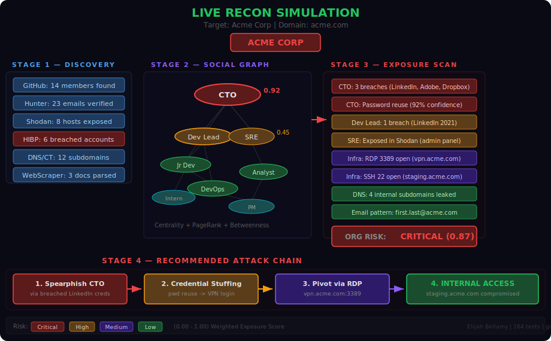
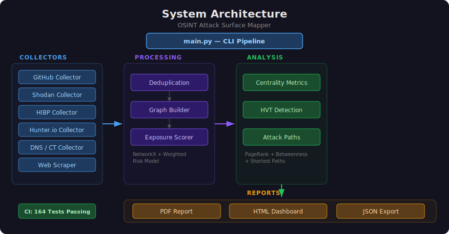
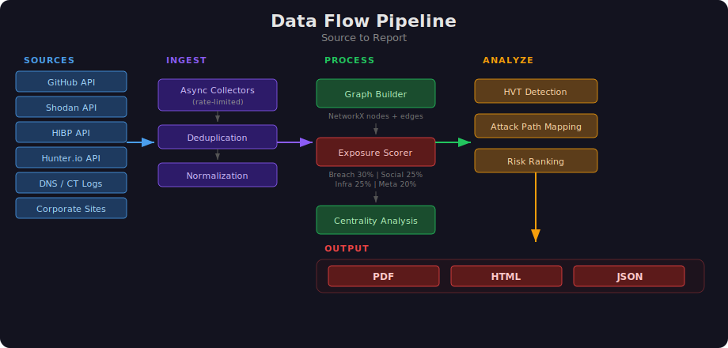
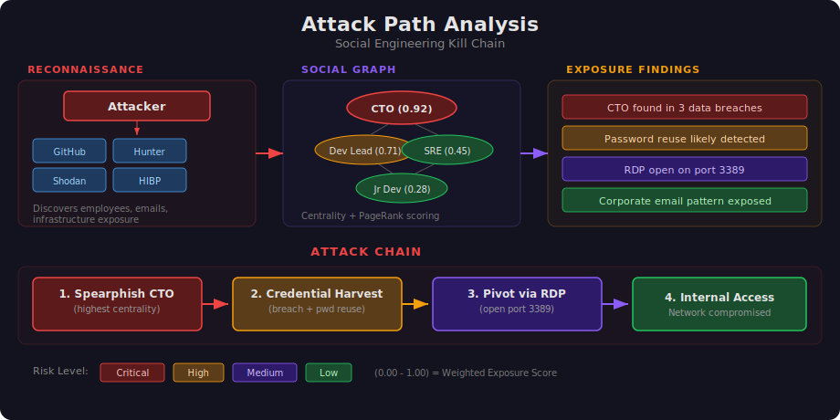

# OSINT Recon & Social Network Attack Surface Mapper


A red team OSINT tool that maps an organization's social network attack surface through ethical open-source intelligence gathering, scores exposure risk, and generates professional assessment reports.

<p align="center">
  
</p>

## What It Does

This tool automates the OSINT reconnaissance phase of a red team engagement:

1. **Discovers** employees and accounts across GitHub, corporate websites, and public records
2. **Maps** relationships between people using social network graph analysis
3. **Checks** discovered accounts against breach databases (Have I Been Pwned) and infrastructure exposure (Shodan)
4. **Scores** individual and organizational exposure using a weighted risk model
5. **Identifies** high-value targets and optimal social engineering attack paths
6. **Generates** professional PDF/HTML reports with interactive network visualizations

## Architecture

<p align="center">
  
</p>

### Data Flow

<p align="center">
  
</p>

### Attack Path Analysis

<p align="center">
  
</p>

## Quick Start

```bash
# Clone the repo
git clone https://github.com/yourusername/osint-mapper.git
cd osint-mapper

# Create virtual environment
python -m venv venv
source venv/bin/activate  # Windows: venv\Scripts\activate

# Install dependencies
pip install -r requirements.txt

# Configure API keys
cp config/settings.yaml config/settings.local.yaml
# Edit settings.local.yaml with your API keys

# Run the demo (no API keys needed!)
python main.py --demo

# Or run a real assessment
python main.py --target "Example Corp" --domain example.com
```

## Configuration

Copy `config/settings.yaml` to `config/settings.local.yaml` and add your API keys:

| API | Required | Free Tier | Purpose |
|-----|----------|-----------|---------|
| GitHub Token | Recommended | Yes (5000 req/hr) | Org member discovery, commit analysis |
| Shodan API Key | Optional | Yes (limited) | Infrastructure scanning |
| HIBP API Key | Optional | $3.50/month | Breach exposure checking |
| Hunter.io API Key | Optional | Yes (25 req/month) | Email discovery and verification |

## Demo Mode

Run a full assessment against a synthetic organization with **zero configuration** — no API keys needed:

```bash
python main.py --demo
```

This generates all six output files (PDF report, HTML dashboard, JSON findings, interactive network graph, GEXF export, and raw discovery data) using a realistic fake company called "NovaTech Solutions" with 12 employees, breach data, CVEs, open ports, and subdomains. It is the fastest way to see every feature in action.

## Usage Examples

```bash
# Demo mode (no API keys needed)
python main.py --demo

# Full assessment with all collectors
python main.py --target "Acme Corp" --domain acme.com

# GitHub-only reconnaissance
python main.py --target "Acme Corp" --collectors github

# Verbose output for debugging
python main.py --target "Acme Corp" --domain acme.com -v

# Custom output directory
python main.py --target "Acme Corp" -o ./reports
```

## Output

The tool generates three report formats:

- **PDF Report** - Professional red team assessment with executive summary, network graphs, exposure scores, attack paths, and remediation recommendations
- **HTML Report** - Interactive version with clickable network graph and sortable findings tables
- **JSON Export** - Machine-readable findings for integration with other tools

## Project Structure

```
OSINT/
├── main.py                    # CLI entry point and pipeline orchestration
├── requirements.txt           # Python dependencies
├── config/
│   └── settings.yaml          # Configuration template
├── src/
│   ├── recon/
│   │   ├── discovery.py       # Discovery engine and data models
│   │   ├── collectors.py      # GitHub, Shodan, HIBP, WebScraper collectors
│   │   ├── hunter_collector.py  # Hunter.io email discovery
│   │   └── dns_collector.py   # DNS records and certificate transparency
│   ├── graph/
│   │   ├── network.py         # NetworkX graph builder and analysis
│   │   └── builder.py         # OSINT-specific graph construction
│   ├── scoring/
│   │   └── exposure.py        # Exposure scoring engine
│   ├── reporting/
│   │   └── generator.py       # PDF/HTML/JSON report generation
│   ├── demo/
│   │   └── generator.py       # Synthetic data for --demo mode
│   └── utils/
├── tests/
│   ├── test_discovery.py
│   ├── test_network.py
│   ├── test_scoring.py
│   ├── test_phase2_collectors.py
│   ├── test_phase3_collectors.py
│   ├── test_reporting.py
│   └── test_demo.py
├── data/
│   ├── raw/                   # Raw collected data
│   ├── processed/             # Normalized data
│   └── exports/               # Generated reports
├── docs/
│   └── ROADMAP.md             # Development roadmap
└── templates/                 # Report templates
```

## Ethical Use

This tool is designed for **authorized red team engagements and security research only**. By using this tool you agree to:

- Only target organizations you have written authorization to assess
- Respect rate limits and robots.txt on all data sources
- Never use collected data for malicious purposes
- Follow responsible disclosure practices for any vulnerabilities discovered
- Comply with all applicable laws and regulations (CFAA, GDPR, etc.)

## Tech Stack

Python 3.10+ | NetworkX | Shodan API | HIBP API | Hunter.io API | ReportLab | Chart.js | vis.js | BeautifulSoup

## License

MIT License - See LICENSE for details.

## Author

Elijah Bellamy - Cybersecurity Analyst
